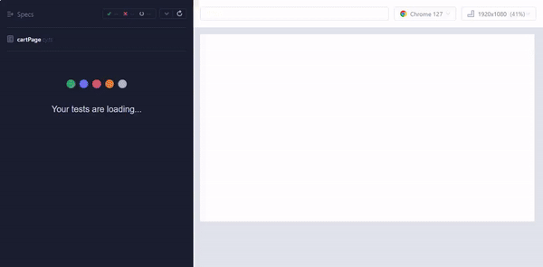

# cypress_website
This repository demonstrates my skills in automation. I use a free website called automationexercise.com to practice and improve my abilities. I have completed all 22 tests offered by the site, applying best practices. I also integrated it with GitHub Actions. For any questions or inquiries, feel free to send me a message on LinkedIn: LinkedIn Profile.


## Project Setup
To set up the project, install Node.js and npm, and run the following commands:
npm install

If you want to start a new project run the following commands:
npm init
npm install typescript --save-dev
npx tsc --init
yarn add --dev cypress
yarn add --dev typescript @types/cypress
npm install faker-br --save-dev

<div align="center">
  <h3>Example: Cart Test</h3>
  
</div>
<div align="center">
  <h3>Example: Create Account Test</h3>
  
</div>
```